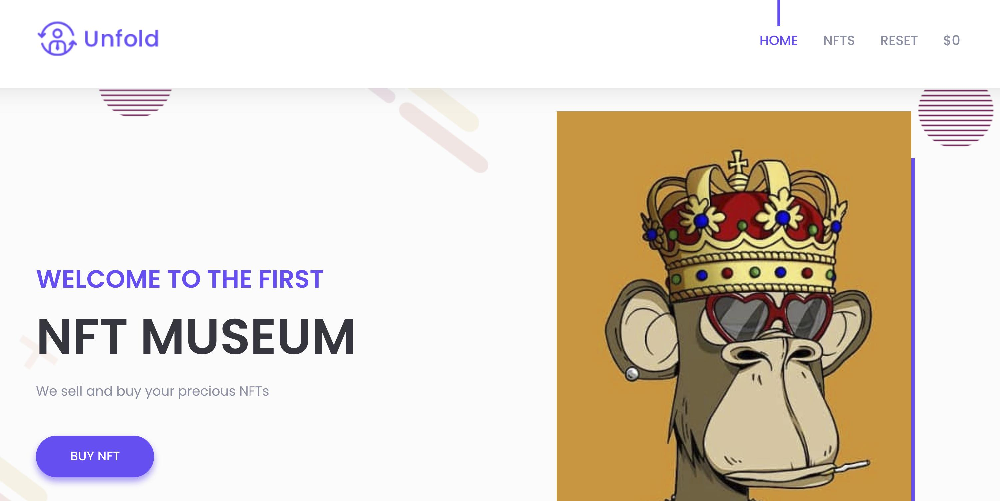

# Challenge 1 - Hack The NFT Museum

## Requirements

- A running kubernetes cluster (you can use [Minikube](https://minikube.sigs.k8s.io/docs/start/) or [Kind](https://kind.sigs.k8s.io/))
- [Kustomize](https://kustomize.io/)
- Go 1.17 or newer <https://go.dev/dl/>
- Make <https://www.gnu.org/software/make/>

## Download Repository

```bash
git clone https://github.com/Alevsk/dvka && cd dvka/challenge-1
```

## Run Lab

There are several ways to run this lab

- [Locally in your machine](#compile-and-run-the-lab-binary-locally)
- [As a docker container](#build-docker-image-and-run-docker-container)
- [Kubernetes deployment](#deploy-the-lab-to-kubernetes)

### Compile and Run the Lab Binary Locally

```bash
# compile the binary
make && cd cmd/app
# run the binary
DVKA_LAB1_SIGNING_KEY="" DVKA_LAB1_FLAG="" ./lab1
```

### Build Docker Image and Run Docker Container

```bash
# build docker image
TAG=alevsk/dvka:lab-1 make docker
# run container using docker
docker run --rm -p 8080:8080 -e DVKA_LAB1_SIGNING_KEY="" -e DVKA_LAB1_FLAG="" --name=dvka-labl-1 alevsk/dvka:lab-1
# or using docker-compose
docker-compose up -d
```

### Deploy the Lab to Kubernetes

> Optional: configure various parameters of the challenge using `k8s/base/secret.yaml` and `k8s/base/deployment.yaml` files

```bash
# deploy the Lab using
kustomize build k8s/base | kubectl apply -f -
# Expose lab-1 application service
kubectl port-forward svc/nft-store 8080:8080 -n lab-1
```

## Access the Lab

Open your browser and go to <http://localhost:8080/>



## Key Concepts for This Lab

- [Directory traversal](https://en.wikipedia.org/wiki/Directory_traversal_attack)
- [SSRF (Server Side Request Forgery)](https://portswigger.net/web-security/ssrf)
- [Service account token](https://kubernetes.io/docs/reference/access-authn-authz/authentication/#service-account-tokens)
- [Kube-apiserver](https://kubernetes.io/docs/reference/command-line-tools-reference/kube-apiserver/)

## Terminate the Lab

### Local Binary

- Stop the program with `ctrl-c`

### Docker

- Stop the `docker run` command with `ctrl-c`
- If using `docker-compose` then `docker-compose down`

### Kubernetes

- Stop the `port-forward` command with `ctrl-c`

```bash
# delete the lab from the cluster
kustomize build k8s/base | kubectl delete -f -
```
