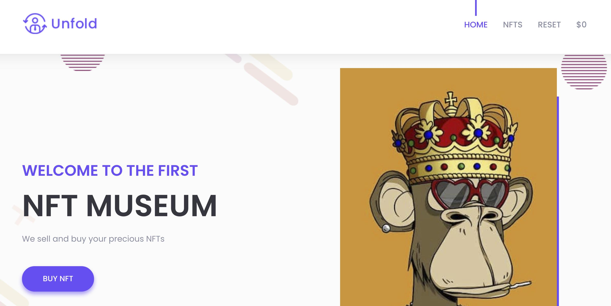

# Challenge 1: Hack The NFT Museum

Welcome to the NFT Museum challenge! In this scenario, you'll explore common security vulnerabilities in cloud-native environments by attempting to compromise a modern NFT marketplace running on Kubernetes.

## Scenario

You've discovered a new NFT marketplace that claims to be revolutionizing the digital art world. However, your security research suggests that the application might have some critical vulnerabilities. Your mission is to investigate the platform and find potential security flaws that could lead to a compromise of the application.

## Your Objective

Your objective is to find the hidden flag by exploiting a series of vulnerabilities in the application. The path to success involves:

*   **Initial Access**: Start by exploring the NFT marketplace's web interface and look for ways to manipulate the application's file handling mechanisms.
*   **Chained Vulnerabilities**: The flag is hidden somewhere in the infrastructure, but finding it will require chaining multiple vulnerabilities.

## Attack Chain

This challenge simulates a realistic attack path that combines multiple security concepts:

1.  **Web Application Exploitation**: Begin by identifying and exploiting web application vulnerabilities.
2.  **Infrastructure Interaction**: Learn how the application interacts with its underlying Kubernetes infrastructure.
3.  **Kubernetes API Access**: Understand how to leverage compromised credentials to interact with the Kubernetes API.

## Key Concepts

*   **Directory Traversal**: Understanding how applications handle file paths and exploiting improper file path validation.
*   **Server-Side Request Forgery (SSRF)**: How internal services can be accessed through vulnerable applications and the implications of SSRF in cloud-native environments.
*   **Kubernetes Security**: Service account tokens and their capabilities, interaction with the Kubernetes API server, and container escape techniques.

For technical setup and deployment instructions, please refer to the [Development Guide](./DEVELOPMENT.md).

Good luck, and happy hacking!