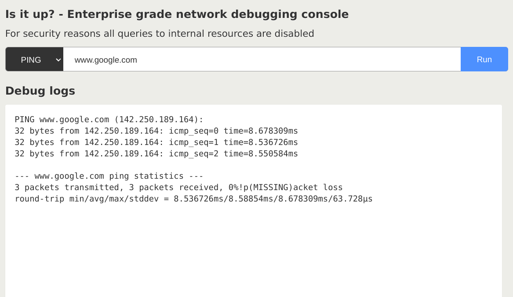

# Challenge 2: The Debug Console

Welcome to the Debug Console challenge! In this scenario, you'll explore how a seemingly harmless debug console can be exploited to gain access to the underlying infrastructure.

## Scenario

You've discovered a debug console that allows you to run commands on the server. Your mission is to use this console to find the hidden flag.



## Your Objective

Your objective is to find the hidden flag by exploiting the debug console.

## Key Concepts

-   **Server-Side Request Forgery (SSRF)**: Understanding how to use a vulnerable application to make requests to internal services.
-   **Cluster Networking**: Understanding how pods communicate with each other in a Kubernetes cluster.
-   **Network Policies**: Understanding how to use network policies to restrict traffic between pods.
-   **Web Application Firewall (WAF)**: Understanding how a WAF can be used to protect against web application attacks.

## Deployment

1.  **Deploy the Application**

    ```bash
    kustomize build k8s/base | kubectl apply -f -
    ```

2.  **Expose the Application**

    ```bash
    kubectl port-forward svc/debug-console 8080:8080 -n lab-2
    ```

3.  **Access the Application**

    Open your browser and navigate to <http://localhost:8080/>.

## Cleanup

    ```bash
    kustomize build k8s/base | kubectl delete -f -
    ```
