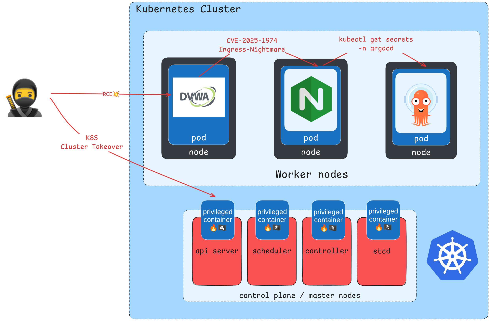

# Red Teaming Kubernetes: From App-Level CVEs to Full Cluster Takeover

Welcome to the Red Teaming Kubernetes challenge! This scenario is designed to simulate a realistic, multi-stage attack against a modern cloud-native environment. Your goal is to start with a single application-level vulnerability and progressively pivot, escalate, and compromise your way to a full cluster takeover.

## Scenario Overview

The challenge is structured around finding five flags. Each flag represents a key milestone in the attack chain, proving you have successfully completed a critical phase of the operation. Follow the trail, chain the vulnerabilities, and see if you have what it takes to own the cluster.

## Challenge Flags

Your mission is to find the five flags hidden throughout the environment. Each one will require a new technique to uncover.

* **Flag 1: Initial Access**
  * Compromise the public-facing web application and gain Remote Code Execution (RCE). The first flag is hidden on the container's local file system. Finding it proves you have established your initial foothold.

* **Flag 2: Lateral Movement**
  * Leverage your initial access to pivot and exploit a vulnerability in the `ingress-nginx` controller. This flag is waiting for you inside the compromised controller's container, demonstrating a successful lateral move into a more critical part of the infrastructure.

* **Flag 3: Credential Exfiltration**
  * With control of the Ingress controller, you can now interact with the Kubernetes API. Exfiltrate the service account token associated with `ingress-nginx` and use it to read a specific Kubernetes Secret containing this flag.

* **Flag 4: Privilege Escalation**
  * Use your newfound API access to find and compromise a highly privileged GitOps service (ArgoCD). Steal its powerful credentials and use them to execute commands in other pods across the cluster. This flag is hidden inside one of those pods.

* **Flag 5: Cluster Takeover**
  * Achieve the ultimate objective. Use the highly privileged ArgoCD service account to deploy a malicious pod, break out onto the underlying control plane node, and gain root access. The final flag is located on the node's file system.

## Attack Chain

This scenario follows a logical attack path from the outside in:

1. **Initial Compromise:** Gain a foothold by exploiting a simple Remote Code Execution (RCE) vulnerability in the public-facing DVWA web application.
2. **Internal Pivot & Exploitation:** Move laterally from the web application to the internal network and exploit the fictional `Ingress-Nightmare (CVE-2025-1974)` vulnerability to compromise the `ingress-nginx` controller.
3. **Escalate via Credential Theft:** Use the compromised `ingress-nginx` service account token to access the Kubernetes API and steal the more powerful credentials for the ArgoCD service.
4. **Full Cluster Compromise:** Leverage the ArgoCD credentials to deploy a privileged container, escape to the host, and gain root access on the cluster's control plane node.

Good luck, and happy hacking!
