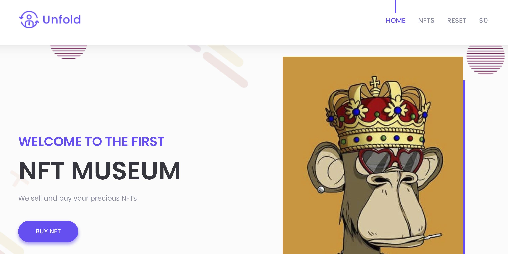

# DVKA (Damn Vulnerable Kubernetes Application) - Lab 1

# Lab Setup

## Requirements

- A running kubernetes cluster (you can use [Minikube](https://minikube.sigs.k8s.io/docs/start/) or [Kind](https://kind.sigs.k8s.io/))
- [Kustomize](https://kustomize.io/)

## Deploy the lab

- `git clone https://github.com/Alevsk/dvka` the repository and then `cd dvka/lab-1`
- Optional: configure various parameters of the challenge using `k8s/base/secret.yaml` and `k8s/base/deployment.yaml` files
- Run: `kustomize build k8s/base | kubectl apply -f -`
- Expose lab-1 application: `kubectl port-forward svc/nft-store 8080:8080 -n lab-1`
- Open your browser and go to http://localhost:8080/
- Happy hacking

# Key Concepts

- [Directory traversal](https://en.wikipedia.org/wiki/Directory_traversal_attack)
- [SSRF (Server Side Request Forgery)](https://portswigger.net/web-security/ssrf)
- [Service account token](https://kubernetes.io/docs/reference/access-authn-authz/authentication/#service-account-tokens)
- [Kube-apiserver](https://kubernetes.io/docs/reference/command-line-tools-reference/kube-apiserver/)

# End the lab

- Stop the `port-forward` command
- `kustomize build k8s/base | kubectl delete -f -`