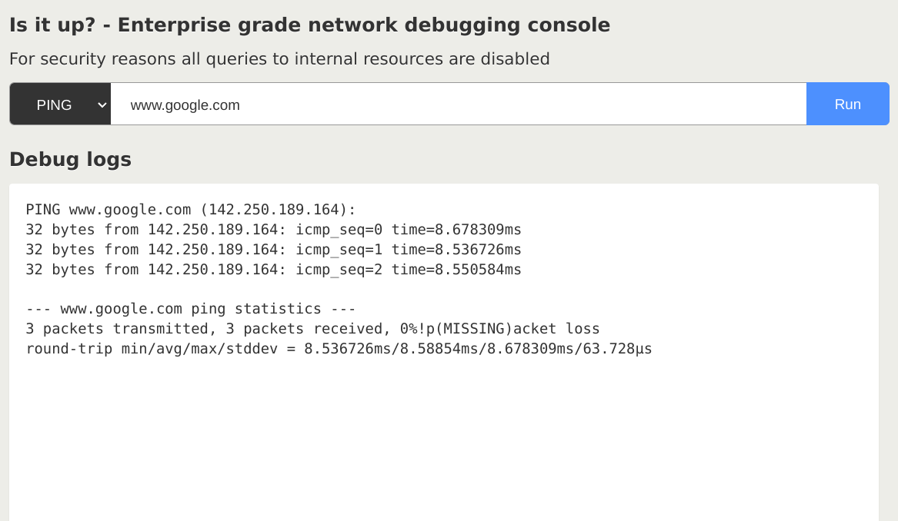

# DVKA (Damn Vulnerable Kubernetes Application) - Lab 2

# Lab Setup

## Requirements

- A running kubernetes cluster (you can use [Minikube](https://minikube.sigs.k8s.io/docs/start/) or [Kind](https://kind.sigs.k8s.io/))
- [Kustomize](https://kustomize.io/)

## Deploy the lab

- `git clone https://github.com/Alevsk/dvka` the repository and then `cd dvka/lab-2`
- Optional: configure various parameters of the challenge in `k8s/base/deployment.yaml`
- Run: `kustomize build k8s/base | kubectl apply -f -`
- Expose lab-2 application: `kubectl port-forward svc/debug-console 8080:8080 -n lab-1`
- Open your browser and go to http://localhost:8080/
- Happy hacking

# Key Concepts

- [SSRF (Server Side Request Forgery)](https://portswigger.net/web-security/ssrf)
- [Cluster Networking](https://kubernetes.io/docs/concepts/cluster-administration/networking/)
- [Network Policies](https://kubernetes.io/docs/concepts/services-networking/network-policies/)
- [Web Application Firewall](https://owasp.org/www-community/Web_Application_Firewall)

# End the lab

- Stop the `port-forward` command
- `kustomize build k8s/base | kubectl delete -f -`