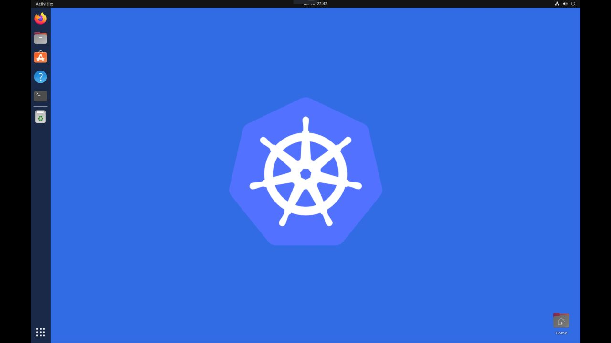

# 🛠️ Kubernetes Security Workshop: Hands-On Attack and Defense

Learn everything you need to know to be proficient at `Kubernetes` security.

## ⚙️ Tools Used During The Workshop

The provided **virtual machine** contains everything you need to go over the labs:

1. Install the right version of [Oracle VM VirtualBox](https://www.virtualbox.org/wiki/Downloads) or [VMware Workstation Player](https://www.vmware.com/content/vmware/vmware-published-sites/us/products/workstation-player/workstation-player-evaluation.html.html) for your system.

1. Download the `Kubernetes Security Workshop` image using the following [link 🔗](https://drive.google.com/file/d/12IX4xGvfqgZLrtutimWqQdxpJRRzDPto/view) (size: 26.5G).

1. Run VirtualBox / Vmware Player and import the virtual machine image (virtual machine size: 100G once imported).

1. Login into the virtual machine.

> 🔒 Credentials - **username:** kubernetes / **password:** security

---

Alternatively, you can manually install the following tools on your system (Linux & Mac OSX):

- [jq](https://jqlang.github.io/jq/)
- [Docker](https://docs.docker.com/engine/install/)
- [Kind](https://kind.sigs.k8s.io/docs/user/quick-start/#installation)
- [kubectl](https://kubernetes.io/docs/tasks/tools/#kubectl)
- [Kustomize](https://kustomize.io/)
- [k9s](https://k9scli.io/topics/install/)
- [mkcert](https://github.com/FiloSottile/mkcert)
- [kube-bench](https://raw.githubusercontent.com/aquasecurity/kube-bench/main/job.yaml)
- [kube-hunter](https://github.com/aquasecurity/kube-hunter)
- [kube-linter](https://github.com/stackrox/kube-linter/releases/download/v0.6.5/kube-linter-linux.tar.gz)
- [terrascan](https://github.com/tenable/terrascan/releases/download/v1.18.3/terrascan_1.18.3_Linux_x86_64.tar.gz)
- [kubeaudit](https://github.com/Shopify/kubeaudit/releases/download/v0.22.0/kubeaudit_0.22.0_linux_amd64.tar.gz)

## Lab Series

### 👶 Beginner

- [Create New Kubernetes Cluster Using Kind](./lab-1/README.md)
- [Explore ~/.kube/config File And Kubectl Command](./lab-2/README.md)
- [Explore k9s To Manage Your Cluster](./lab-3/README.md)
- [Deploy Kubernetes Workload](./lab-4/README.md)
- [Get a Shell to a Running Container](./lab-5/README.md)
- [ConfigMaps & Secrets](./lab-6/README.md)
- [Namespaces](./lab-7/README.md)
- [Pod Security Context](./lab-8/README.md)

### 👩‍💻 Intermediate

- Kubernetes certificate authority (Coming soon)
- cert-manager: X.509 certificate management for Kubernetes (Coming soon)
- [Pod Resource Limits](./lab-9/README.md)
- [Scratch Containers](./lab-10/README.md)
- Pod Security Policies (Coming soon)
- Open Policy Agent (Coming soon)
- [Service Account Token](./lab-11/README.md)
- [Network Security Policies With Calico](./lab-12/README.md)

### 🥷 Advanced

- Vault K8s: Encrypted Kubernetes secrets (Coming soon)
- Pod SecComp profiles (Coming soon)
- Pod AppArmor profiles (Coming soon)
- Debug Distroless And Slim Containers (Coming soon)
- The Istio service mesh (Coming soon)
- [kube-bench: CIS Kubernetes Benchmark](./lab-13/README.md)
- [kube-hunter: Hunt for security weaknesses in Kubernetes clusters](./lab-14/README.md)
- [kube-linter: Check Kubernetes YAML files and Helm charts](./lab-15/README.md)
- [terrascan: Static code analyzer for Infrastructure as Code](./lab-16/README.md)
- [kubeaudit: Audit your Kubernetes clusters against common security controls](./lab-17/README.md)
- Deploy privileged container, A Container That Doesn't Contain Anything (Coming soon)
- Container escape (Coming soon)
- Container Runtime Exploit `CVE-2019-5736` (Coming soon)
- Kubernetes misconfiguration (Coming soon)
