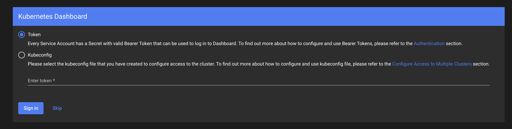

# Exposed sensitive interfaces

Exposing a sensitive interface to the internet or within a cluster without strong authentication poses a security risk. Some popular cluster management services were not intended to be exposed to the internet, and therefore don’t require authentication by default. Thus, exposing such services to the internet allows unauthenticated access to a sensitive interface which might enable running code or deploying containers in the cluster by a malicious actor. Examples of such interfaces that were seen exploited include Apache NiFi, Kubeflow, Argo Workflows, Weave Scope, and the Kubernetes dashboard.

In addition, having such services exposed within the cluster network without strong authentication can also allow an attacker to collect information about other workloads deployed to the cluster. The Kubernetes dashboard is an example of such a service that is used for monitoring and managing the Kubernetes cluster. The dashboard allows users to perform actions in the cluster using its service account (kubernetes-dashboard) with permissions that are determined by the binding or cluster-binding for this service account. Attackers who gain access to a container in the cluster, can use its network access to the dashboard pod. Consequently, attackers may retrieve information about the various resources in the cluster using the dashboard’s identity.

## Quick Start

1. Prepare the environment by deploying the `kubernetes-dashboard`

    ```bash
    kubectl apply -f kubernetes-dashboard.yaml
    ```

2. Locally expose kubernetes-dashboard service

    ```bash
    kubectl port-forward svc/kubernetes-dashboard 8000:443 -n kubernetes-dashboard
    ```

3. Open your browser and go to <https://localhost:8000/>

    > Notice you can access the dashboard by clicking on the `skip` button without providing any authentication

    

4. Analyze the `kubernetes-dashboard.yaml` file, as well as the `serviceaccounts`, `clusterroles` and `clusterrolebindings` used by the `kubernetes dashboard`

    ```bash
    # list serviceaccounts
    kubectl get serviceaccounts -n kubernetes-dashboard
    # list clusterroles
    kubectl get clusterroles
    # list clusterrolebindings
    kubectl get clusterrolebindings
    ```

5. Terminate the kubernetes dashboard application

    > `<ctrl+c>` to stop the `port-forward` command

    ```bash
    kubectl delete -f kubernetes-dashboard.yaml
    ```

## Resouces

- <https://kubernetes.io/docs/tasks/access-application-cluster/web-ui-dashboard/>
- <https://medium.com/@tejaswi.goudru/disable-authentication-https-in-kubernetes-dashboard-2fada478ce91>
