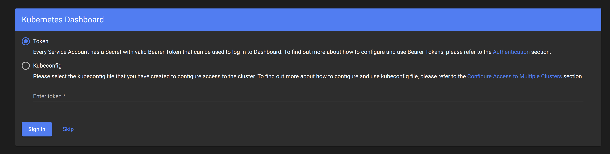

# Exposed Sensitive Interfaces

Cluster management UIs and APIs that are exposed without strong authentication give attackers a direct path to enumerate workloads, extract secrets, and execute commands — without ever needing to exploit a container vulnerability.

## Description

Exposing a sensitive interface to the internet or within a cluster without strong authentication poses a security risk. Some popular cluster management services were not intended to be exposed to the internet, and therefore don't require authentication by default. Exposing such services allows unauthenticated access to a sensitive interface which can enable running code or deploying containers in the cluster. Examples of such interfaces that have been seen exploited include Apache NiFi, Kubeflow, Argo Workflows, Weave Scope, and the Kubernetes Dashboard.

In addition, having such services exposed within the cluster network without strong authentication can allow an attacker to collect information about other workloads deployed to the cluster. The Kubernetes Dashboard is used for monitoring and managing the cluster. The dashboard acts using its own service account (`kubernetes-dashboard`) with permissions determined by the bound ClusterRole. In this scenario, the dashboard service account is bound to `cluster-admin`, meaning any unauthenticated user who can reach the dashboard has full control of the cluster.

## Prerequisites

- A running Kind cluster (`workshop-cluster`).
- `kubectl` installed and configured to connect to your cluster.
- A web browser.

## Quick Start

### Step 1 — Deploy the Kubernetes Dashboard

The manifest deploys the dashboard with two dangerous flags enabled: `--enable-skip-login` (bypasses authentication) and a `ClusterRoleBinding` that grants `cluster-admin` to the dashboard service account.

```bash
kubectl apply -f kubernetes-dashboard.yaml
```

Wait for both pods to become ready:

```bash
kubectl wait --for=condition=Ready pod -l k8s-app=kubernetes-dashboard \
    -n kubernetes-dashboard --timeout=120s
kubectl wait --for=condition=Ready pod -l k8s-app=dashboard-metrics-scraper \
    -n kubernetes-dashboard --timeout=120s
```

Verify the deployment:

```bash
kubectl get all -n kubernetes-dashboard
```

Example output:

```
NAME                                            READY   STATUS    RESTARTS   AGE
pod/dashboard-metrics-scraper-...              1/1     Running   0          30s
pod/kubernetes-dashboard-...                   1/1     Running   0          30s

NAME                                TYPE        CLUSTER-IP    EXTERNAL-IP   PORT(S)
service/dashboard-metrics-scraper   ClusterIP   10.96.50.10   <none>        8000/TCP
service/kubernetes-dashboard        ClusterIP   10.96.50.11   <none>        443/TCP
```

### Step 2 — Inspect the dangerous RBAC configuration

Before attacking, understand why this configuration is dangerous:

```bash
# Review the ClusterRoleBinding granting cluster-admin to the dashboard
kubectl get clusterrolebinding kubernetes-dashboard -o yaml
```

Key section to notice:

```yaml
roleRef:
  kind: ClusterRole
  name: cluster-admin   # <-- full cluster access
subjects:
  - kind: ServiceAccount
    name: kubernetes-dashboard
    namespace: kubernetes-dashboard
```

```bash
# List all service accounts in the dashboard namespace
kubectl get serviceaccounts -n kubernetes-dashboard

# Confirm the dashboard is configured with --enable-skip-login
kubectl get deployment kubernetes-dashboard -n kubernetes-dashboard \
    -o jsonpath='{.spec.template.spec.containers[0].args}' | tr ',' '\n'
```

### Step 3 — Access the dashboard without authentication

Expose the dashboard service locally via port-forward:

```bash
kubectl port-forward svc/kubernetes-dashboard 8000:443 -n kubernetes-dashboard
```

Open your browser and navigate to:

```
https://localhost:8000/
```

When the login screen appears, click **Skip** — no token or kubeconfig is required. You now have full `cluster-admin` access through the browser UI.



> The **Skip** button is present because the dashboard was deployed with `--enable-skip-login`. This is a known dangerous configuration that has been exploited in the wild.

### Step 4 — Enumerate cluster resources through the dashboard UI

Once inside the dashboard, navigate to:

- **Namespaces** — list all namespaces in the cluster.
- **Pods** — view all running pods across all namespaces.
- **Secrets** — read Secret resources (including service account tokens and TLS certs).
- **Config Maps** — read ConfigMap contents, which may include application credentials.
- **Deployments** — view and modify workloads.

### Step 5 — Execute commands in a pod via the dashboard

The dashboard provides an exec interface for running commands inside containers:

1. Navigate to **Workloads > Pods**.
2. Select any running pod.
3. Click the **Exec** button (terminal icon) in the top-right of the pod detail view.
4. A shell opens inside the container — from here an attacker can exfiltrate data, install tools, or establish persistence.

### Step 6 — Exploit the dashboard from within the cluster (API access)

An attacker who has already breached a pod can reach the dashboard's service IP directly, without port-forwarding, because Kubernetes networking allows cross-namespace service access by default. The attacker obtains a token from the dashboard's service account and uses it against the Kubernetes API:

```bash
# From the attacker pod — resolve the dashboard service
DASHBOARD_IP=$(kubectl get svc kubernetes-dashboard -n kubernetes-dashboard \
    -o jsonpath='{.spec.clusterIP}')

# The dashboard proxies API requests using its cluster-admin service account
# In Kubernetes 1.24+, service account tokens are no longer stored as Secrets by default.
# Use the TokenRequest API to generate a bound token on demand:
TOKEN=$(kubectl create token kubernetes-dashboard -n kubernetes-dashboard --duration=1h)
echo $TOKEN
```

Use that token to call the Kubernetes API directly:

```bash
kubectl --token="${TOKEN}" get secrets --all-namespaces
kubectl --token="${TOKEN}" get pods --all-namespaces
```

> **Note (Kubernetes 1.24+):** Static service account token Secrets (`kubernetes.io/service-account-token` type) are no longer automatically created for new service accounts. Use `kubectl create token <sa-name> -n <namespace>` to generate a short-lived token on demand, or manually create a long-lived token Secret if needed for legacy compatibility.

### Step 7 — Probe other sensitive interfaces

While the port-forward is running, explore other interfaces that are commonly exposed:

```bash
# Kubelet read-only API (port 10255) — no auth required in older clusters
# Replace NODE_IP with an actual node IP from: kubectl get nodes -o wide
curl -sk http://NODE_IP:10255/pods | python3 -m json.tool | head -50

# Kubelet management API (port 10250) — requires client cert but often misconfigured
curl -sk https://NODE_IP:10250/pods

# kube-apiserver unauthenticated endpoint check
curl -sk https://NODE_IP:6443/version
```

Stop the port-forward with `Ctrl+C` when done.

## Cleanup

```bash
kubectl delete -f kubernetes-dashboard.yaml
```

## Resources

- [Kubernetes Dashboard](https://kubernetes.io/docs/tasks/access-application-cluster/web-ui-dashboard/)
- [MITRE ATT&CK - Exposed Sensitive Interfaces](https://attack.mitre.org/techniques/T1133/)
- [Kubernetes RBAC](https://kubernetes.io/docs/reference/access-authn-authz/rbac/)
- [CIS Kubernetes Benchmark - Dashboard](https://www.cisecurity.org/benchmark/kubernetes)
- [Kubelet Authentication and Authorization](https://kubernetes.io/docs/reference/access-authn-authz/kubelet-authn-authz/)
